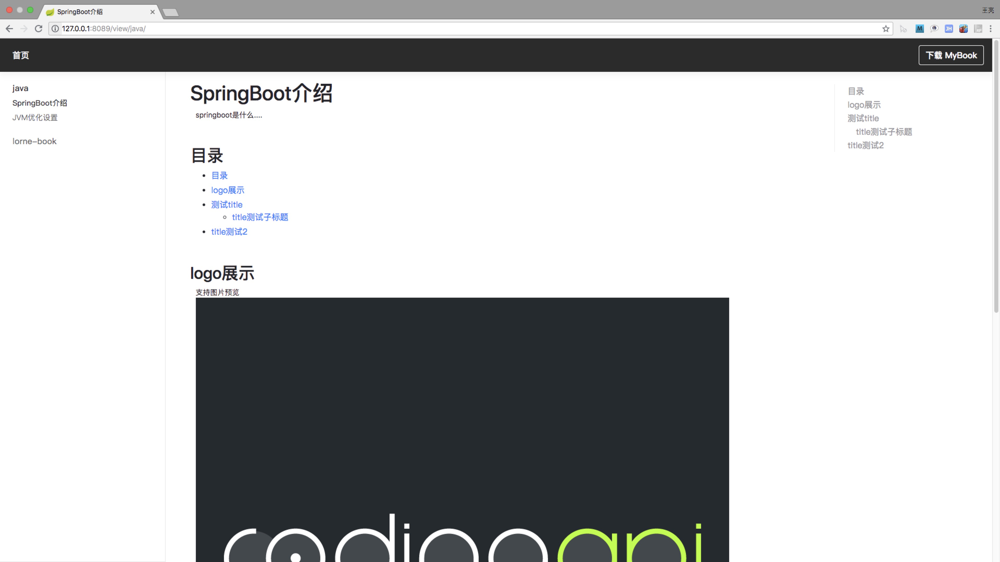

# my-book

> 程序员需要有个个人的博客网站


## 项目介绍

my-book 将markdown 的git项目直接转成博客网站，方便预览。


## 项目支持

markdown基础操作  
支持对markdown的图片做大小控制  
支持table  
支持toc目录  


## 框架解释

1. 项目通过git迁移下远程的markdown项目来;
2. 然后通过flexmark将markdown项目转成html形式
3. 然后在通过thymeleaf呈现界面。

### 针对图片大小控制

通过对图片的裁剪与markdown的参数控制协调实现的


## 使用说明

1. 修改配置信息
```
#markdown git路径
codingapi.mybook.git-url=https://github.com/1991wangliang/lorne-book
#git 账号名称
codingapi.mybook.git-user-name=xxxxxx
#git 账号密码
codingapi.mybook.git-password=xxxxxx
#本次保存路径
codingapi.mybook.git-save-path=/test/mybook
#git 分支
codingapi.mybook.git-branch=master
#更新内容的token参数值
codingapi.mybook.refresh-token=123456

```

2. 启动项目  

访问项目配置路径 http://ip:port


3. 刷新内容

当markdown的git项目内容变化以后可通过请求刷新接口刷新内容。

接口地址 http://ip:port/admin/refresh?token=${codingapi.mybook.refresh-token}


## 效果




## 注意事项

1. markdown下的资源文件都要放在项目的根路径下的static文件夹下.
2. 每一篇内容的标题是获取的markdown文章的第一行内容。
3. markdown git下的目录以及static下的目录最大不可超过三级。(可通过代码增加更多级数)

